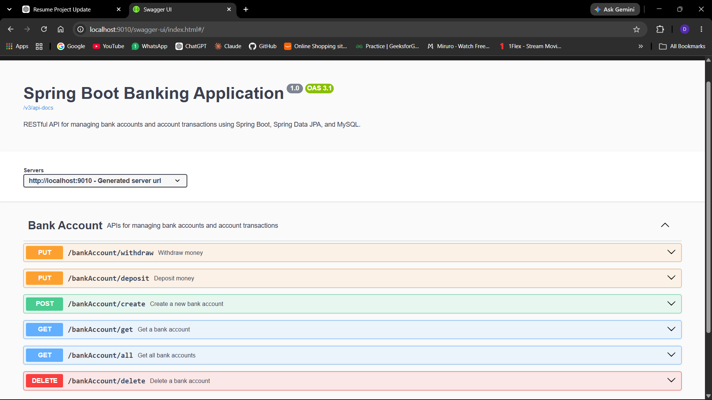
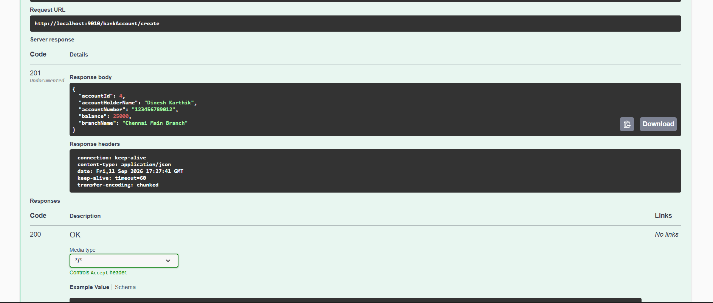
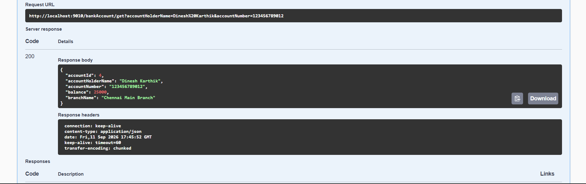
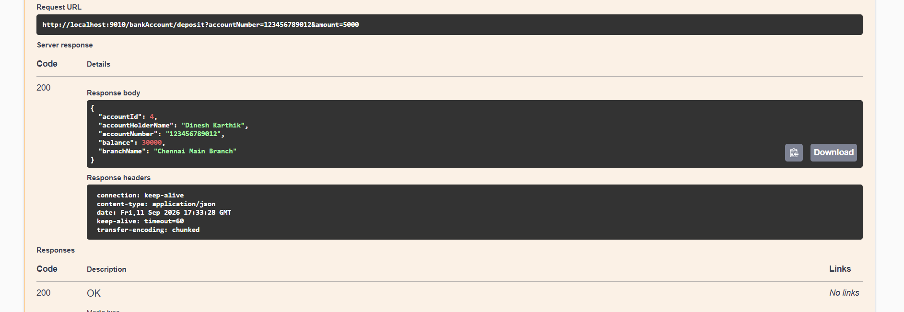
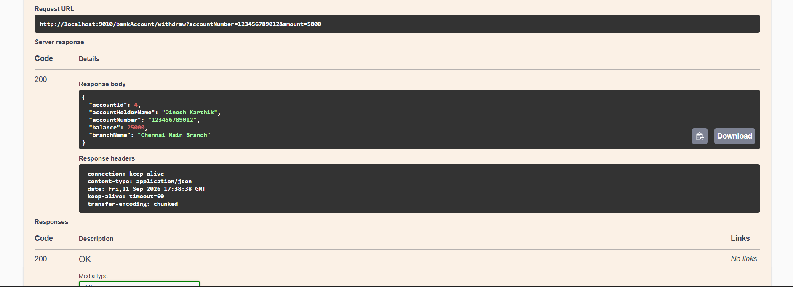
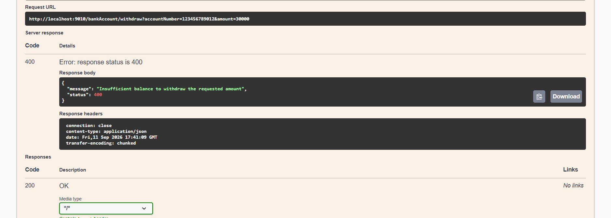
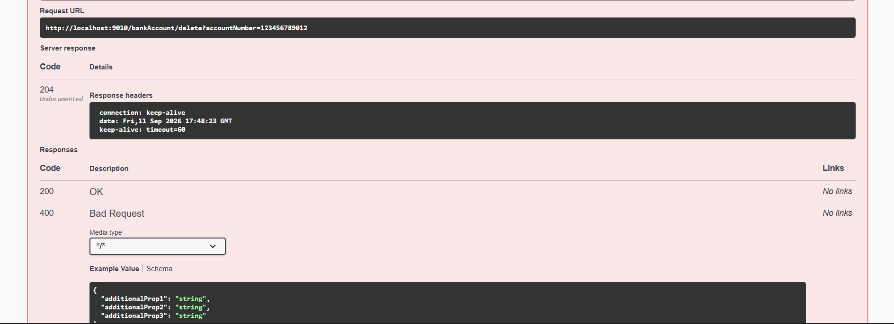

# Spring Boot Banking Application

A RESTful banking application built using Spring Boot for managing bank accounts and performing account-related operations.

## Features

- Create a new bank account
- Retrieve all bank accounts
- Retrieve an account using account holder name and account number
- Deposit money into an account
- Withdraw money from an account
- Delete a bank account
- Input validation for account details
- Deposit and withdrawal amount validation
- Insufficient balance validation
- Custom exception handling
- Centralized exception handling
- Proper HTTP status codes
- MySQL database integration
- Swagger UI for API documentation and testing

## Technologies Used

- Java 21
- Spring Boot
- Spring Data JPA
- Hibernate
- MySQL
- REST API
- Swagger UI
- OpenAPI
- Maven
- Lombok

## API Endpoints

| Method | Endpoint | Description |
|--------|----------|-------------|
| POST | `/bankAccount/create` | Create a new bank account |
| GET | `/bankAccount/all` | Retrieve all bank accounts |
| GET | `/bankAccount/get` | Retrieve an account by holder name and account number |
| PUT | `/bankAccount/deposit` | Deposit money into an account |
| PUT | `/bankAccount/withdraw` | Withdraw money from an account |
| DELETE | `/bankAccount/delete` | Delete a bank account |

## HTTP Status Codes

| Status Code | Usage |
|-------------|-------|
| `200 OK` | Successful retrieval, deposit, or withdrawal |
| `201 CREATED` | Bank account created successfully |
| `204 NO CONTENT` | Bank account deleted successfully |
| `400 BAD REQUEST` | Invalid input, account not found, or insufficient balance |

## Validation and Exception Handling

The application implements:

- Bean Validation for account details
- Account number format validation
- Balance validation
- Deposit amount validation
- Withdrawal amount validation
- Insufficient balance validation
- Custom `BankAccountException`
- Centralized exception handling using `@RestControllerAdvice`
- Consistent JSON error responses

Example error response:

    {
        "message": "Insufficient balance to withdraw the requested amount",
        "status": 400
    }

## Project Structure

    src/main/java/com/dinesh/banking/
    ├── config
    │   └── OpenApiConfig.java
    ├── controller
    │   └── BankAccountController.java
    ├── exception
    │   ├── BankAccountException.java
    │   └── GlobalExceptionHandler.java
    ├── model
    │   └── BankAccount.java
    ├── repository
    │   └── BankAccountRepository.java
    ├── service
    │   └── BankAccountService.java
    ├── serviceimpl
    │   └── BankAccountServiceImpl.java
    └── BankingApplication.java

## Database Configuration

Create the MySQL database:

    CREATE DATABASE bank_account;

Configure the database connection in `application.properties`.

The MySQL password is supplied using the `MYSQL_PASSWORD` environment variable instead of storing the password directly in the project.

## Swagger / OpenAPI

Swagger UI is available at:

    http://localhost:9010/swagger-ui/index.html

The API documentation includes:

- Endpoint descriptions
- Request parameters
- Request and response models
- Validation information
- HTTP response codes
- API response descriptions

## API Testing

The REST APIs were tested using:

- Swagger UI
- Postman

Tested scenarios include:

- Account creation
- Account retrieval
- Retrieving all accounts
- Deposit
- Withdrawal
- Insufficient balance handling
- Account deletion
- Verification of deleted accounts

## Screenshots

### Swagger UI - All Endpoints

### Create Account API

### Get Account API

### Deposit API

### Withdraw API

### Insufficient Balance Validation

### Delete Account API

